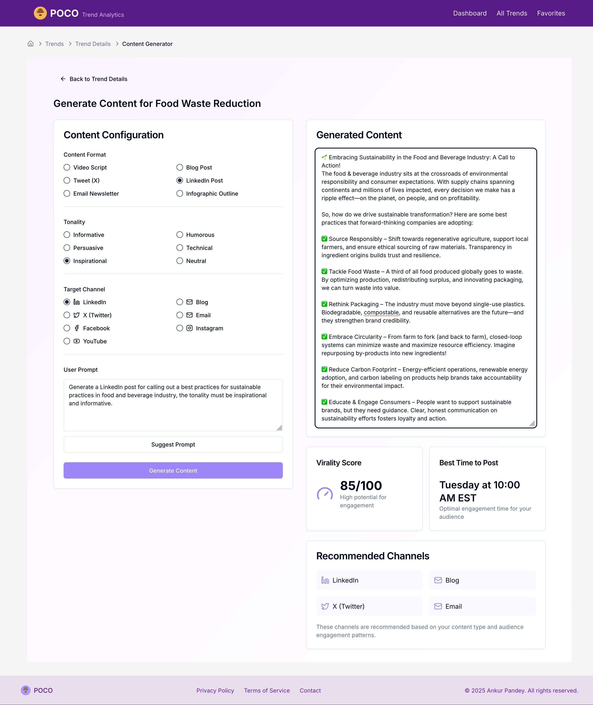

# POCO Trends Analyzer

A modern analytics dashboard for trend analysis and insights. Built with React, TypeScript, and Tailwind CSS.

## Features

### Analytics Dashboard

Comprehensive analytics including performance metrics, audience insights, and ROI tracking.

### Trend Details & Insights

Deep dive into trend patterns, predictive analytics, and content gap analysis.

### Content Generation & Analysis

AI-powered content generation with virality scoring and optimal posting time recommendations.

## Tech Stack

- **Framework:** React + Vite
- **Language:** TypeScript
- **Styling:** Tailwind CSS
- **UI Components:** shadcn/ui
- **Charts:** Recharts
- **Maps:** react-simple-maps
- **Data Fetching:** TanStack Query
- **Date Handling:** date-fns

## Getting Started

### Prerequisites

- Node.js 16+
- npm or yarn

### Installation

1. Clone the repository
```bash
git clone https://github.com/your-username/poco-trends.git
cd poco-trends
```

2. Install dependencies
```bash
npm install
```

3. Start the development server
```bash
npm run dev
```

The app will be available at `http://localhost:8080`

## Project Structure

```
src/
├── components/
│   ├── ui/          # Base UI components
│   └── trends/      # Trend-specific components
├── data/           # Data models and mock data
├── hooks/          # Custom React hooks
├── lib/            # Utility functions
└── pages/          # Page components
```

## Contributing

1. Fork the repository
2. Create your feature branch (`git checkout -b feature/amazing-feature`)
3. Commit your changes (`git commit -m 'Add amazing feature'`)
4. Push to the branch (`git push origin feature/amazing-feature`)
5. Open a Pull Request

## License

This project is licensed under the MIT License - see the LICENSE file for details


